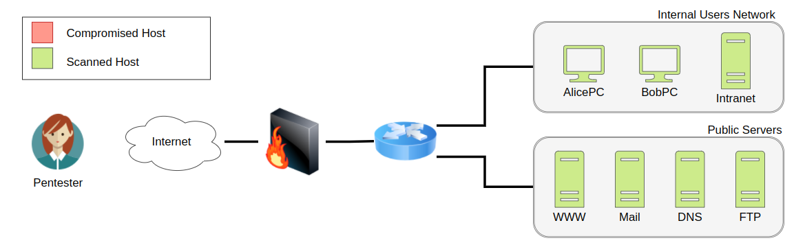
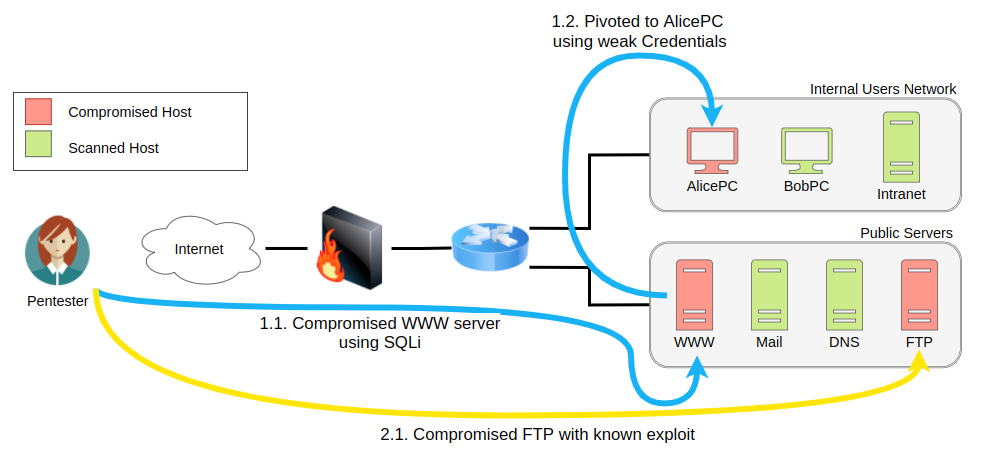

## Vulnerability Assessment and Penetration Tests Limitations

### Vulnerability Assessments
This is the simplest form of security assessment, and its main objective is to identify as many vulnerabilities in as many systems in the network as possible. To this end, concessions may be made to meet this goal effectively. For example, the attacker's machine may be allowlisted on the available security solutions to avoid interfering with the vulnerability discovery process. This makes sense since the objective is to look at every host on the network and evaluate its security posture individually while providing the most information to the company about where to focus its remediation efforts.

To summarize, a vulnerability assessment focuses on scanning hosts for vulnerabilities as individual entities so that security deficiencies can be **identified** and effective security measures can be deployed to **protect** the network in a prioritized manner. Most of the work can be done with automated tools and performed by operators without requiring much technical knowledge.

As an example, if you were to run a vulnerability assessment over a network, you would normally try to scan as many of the hosts as possible, but wouldn't actually try exploiting any vulnerabilities at all:

### Penetration Tests
On top of scanning every single host for vulnerabilities, we often need to understand how they impact our network as a whole. Penetration tests add to vulnerability assessments by allowing the pentester to explore the impact of an attacker on the overall network by doing additional steps that include:

-   Attempt to **exploit** the vulnerabilities found on each system. This is important as sometimes a vulnerability might exist in a system, but compensatory controls in place effectively prevent its exploitation. It also allows us to test if we can use the detected vulnerabilities to compromise a given host.
-   Conduct **post-exploitation** tasks on any compromised host, allowing us to find if we can extract any helpful information from them or if we might use them to pivot to other hosts that were not previously accessible from where we stand.

Penetration tests might start by scanning for vulnerabilities just as a regular vulnerability assessment but provide further information on how an attacker can chain vulnerabilities to achieve specific goals. While its focus remains on **identifying** vulnerabilities and establishing measures to **protect** the network, it also considers the network as a whole ecosystem and how an attacker could profit from interactions between its components.

If we were to perform a penetration test using the same example network as before, on top of scanning all of the hosts on the network for vulnerabilities we would try confirm if they can be exploited in order to show the impact an attacker could have on the network:
